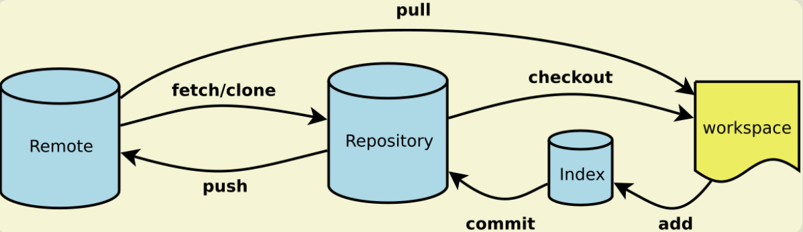

### 常用命令

``` bash
git init 创建版本库
git add <file>  添加文件到版本库
git commit -m  <message> 提交文件到版本库
git status  查看当前版本库的状态
git diff <file> 比较修改的文件
git log 查看提交历史
git reflog 查看历史命令，以便确定回来未来的那个版本
git checkout -- file 直接丢弃工作区的修改
git reset HEAD <file> 已经提交到了暂存区，恢复到工作区的修改(相当于撤消add操作)
git reset --hard <commit_id>  历史版本之前切换
git rm <file> 删除文件相当于git add <file>
git checkout -b <branch name> 创建并切换到分支
git branch  查看当前所有分支
git branch -a 查看所有远程分支
git checkout master 切换为master分支
git merge <branch name> 把 branch name分支合并到当前所在的分支
git branch -d <branch name> 删除分支
git branch -D <branch name> 强制删除分支
git push origin --delete <branch name> 删除远程的分支 
git log --graph --pretty=oneline --abbrev-commit  查看分支合并情况
git merge --no-ff -m "merge with no-ff" <branch name> 使用非Fast Forward方式合并
git stash 保存当前工作现场（前提是已经文件已经add到了index暂存区，新创建的文件还没有add没有用）
把未完成的工作都add之后，git stash 会保存工作空间和index暂存区，以便之后恢复
git stash list 	查看保存的工作现场内容
git stash apply 恢复工作现场,恢复后之前stash的内容不删除，需要手动 git stash drop 来删除
git stash pop 恢复现场的同时也把stash的内容删除
git stash apply stash@{0} 多次stash后，使用恢复到指定的stash
git remote -v  查看远程库信息
git push origin master  把本地的master分支推送到远程origin/master(表示远程的意思)
git pull 当远程仓库的代码比本地的新时,需要先pull再push否则会报错无法push，
(git pull <remote> <branch>  如： git pull origin dev 先拉取远程的dev到本地)
git clone git@github.com:michaelliao/gitskills.git 抓取远程master分支
git clone -b dev git@xxx.git 直接抓取dev分支到本地(直接抓取dev开发,不用clone分支master到本地)
git checkout -b dev origin/dev  创建远程的dev分支到本地进行开发(已经克隆了master分支的情况下,开发dev)
git branch --set-upstream-to <branch-name> origin/<branch-name>  建立本地分支与远程分支的关系
git tag <name> 打标签，先切换到指定的分支上，标签默认是打在最新提交的commit上的
git tag <name> <commit id> 指定标签打到对应的commit id上
git tag  查看标签所有的标签
git show <name> 查看标签信息
git tag -a v0.1 -m "version 0.1 released" 1094adb 打带说明的标签
(注意：标签总是和某个commit挂钩。如果这个commit既出现在master分支，又出现在dev分支，那么在这两个分支上都可以看到这个标签)
git tag -d v1.0 删除本地标签
git push origin :refs/tags/v1.0 删除远程标签
git push origin v1.0 把某个标签推送到远程
git push origin --tags 一次性推送尚未推送到远程的本地标签 
git config --global alias.st status 配置别名如：
git config --global alias.unstage 'reset HEAD'
git config --global user.name "Your Name"
git config --global user.email "email@example.com" （配置文件信息存放在.git/config里）
```

先有本地库，后有远程库

生成ssh key: ssh-keygen -t rsa -C "youremail@example.com"
在当前用户目录下的.ssh目录下找到id_rsa.pub 登陆GitHub，打开“Account settings”，“SSH Keys”页面：然后，点“Add SSH Key”，填上任意Title，在Key文本框里粘贴id_rsa.pub文件的内容。

在github上创建一个project与本地项目名称一样。

添加远程仓库：git remote add origin git@xxx/learngit.git
（当远程仓库为空时，第一次需要把本地仓库推送到远程，在本地仓库所有目录下运行）
然后，使用 git push -u origin master 把本地仓库的代码推送到远程仓库,不仅可推送还把本地仓库与远程的仓库关联起来了，之后可以使用git push origin master推送。


先有远程库，后有本地库

进入系统目录 git clone git@xxx/skills.git  克隆一个本地仓库


忽略配置文件

在git工作区的根目录下创建一个特殊的.gitignore文件，然后把要忽略的文件名填进去，Git就会自动忽略这些文件。
不需要从头写.gitignore文件，GitHub已经为我们准备了各种配置文件，只需要组合一下就可以使用了。所有配置文件可以直接在线浏览：https://github.com/github/gitignore
忽略文件的原则是：
忽略操作系统自动生成的文件，比如缩略图等；
忽略编译生成的中间文件、可执行文件等，也就是如果一个文件是通过另一个文件自动生成的，那自动生成的文件就没必要放进版本库，比如Java编译产生的.class文件；
忽略你自己的带有敏感信息的配置文件，比如存放口令的配置文件。
最后一步就是把.gitignore也提交到Git，就完成了， 或者把.gitignore也添加到.gitignore里面。


参考链接：
https://git-scm.com/docs
http://www.ruanyifeng.com/blog/2015/12/git-cheat-sheet.html
https://www.liaoxuefeng.com/wiki/0013739516305929606dd18361248578c67b8067c8c017b000


解决冲突
dev分支开发，push代码到远程，发起pull request 到master。由于dev与master都修改了相同的文件中相同的行，出现冲突无法自动合并，这时需要手动解决冲突。命令行解决步骤如下：

Step 1: From your project repository, bring in the changes and test.
git fetch origin
git checkout -b dev origin/dev
git merge master
补充：解决冲突的文件，提交到当前分支

Step 2: Merge the changes and update on GitHub.
git checkout master
git merge --no-ff dev
git push origin master


https://git-scm.com/book/zh/v2

gitlab解决冲突合并的

补充：在执行第step3之后，修改冲突文件，comit。
执行step4会报错，如下：
error: src refspec master does not match any.
error: failed to push some refs to 'git@github.com:wangliv/code_generator.git' 
但是使用 git push origin HEAD:<name-of-remote-branch>  
操作成功，这种方式不需要把目标分支（代码将要往那个分支上合的分支），拉到本地。
注意 :<name-of-remote-branch>  不需要加 origin  前缀。


问题

git 提交代码后push到远程后发现，对文件的部分修改变成了，删除之前所有内容，新增后面的内容。

解决方案
先撤回push 
git log 找到之前的commitId
git reset --soft 回退到上一个commitid
git push -f

操作完成后，相当于撤回远程的push，本地修改保留

再使用
git diff -w 查看文件修改记录正常
git reset  取消暂存区修改

git config --global core.autcrlf true 

执行git add .  添加到暂存区
执行git commit ...
执行git push 

完美解决问题。


解决冲突的技巧（merge from master），先直接使用master版本，然后，再使用tortoiseGit与HEAD比较，把自己版本的改动加进来


解决不同操作系统下git换行符一致性问题
一、不同操系统下的换行符
CR回车 LF换行
Windows/Dos CRLF \r\n
Linux/Unix LF \n
MacOS CR \r
二、解决方法
打开git bash，设置core.autocrlf和core.safecrlf（可不设置），建议设置autocrlf为input，safecrlf为true，同时设置你的Eclipse、IDEA等IDE的换行符为LF\n。
下面为参数说明，--global表示全局设置
2.1、autocrlf
#提交时转换为LF，检出时转换为CRLF
git config --global core.autocrlf true 
#提交时转换为LF，检出时不转换
git config --global core.autocrlf input 
#提交检出均不转换
git config --global core.autocrlf false
2.2、safecrlf
#拒绝提交包含混合换行符的文件
git config --global core.safecrlf true 
#允许提交包含混合换行符的文件
git config --global core.safecrlf false 
#提交包含混合换行符的文件时给出警告
git config --global core.safecrlf warn


