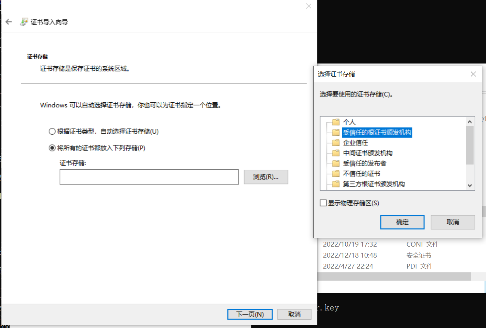
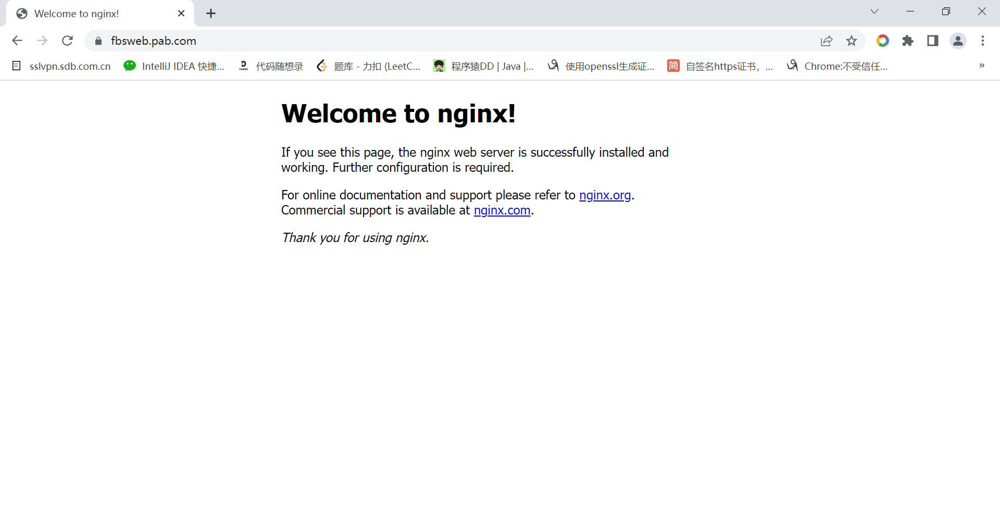
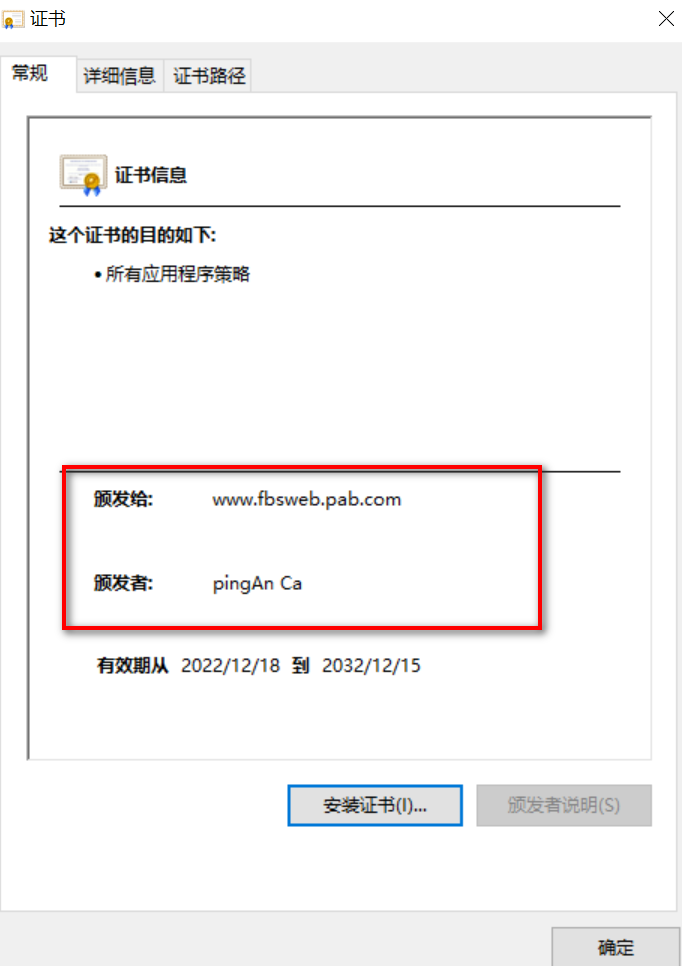

> 环境准备：
Linux 已安装了openssl 

> 准备需要签发的域名 www.fbsweb.pab.com


1. 复制openssl配置文件到当前工作目录

``` bash
cp /etc/ssl/openssl.cnf ./
```


2. 生成CA (根) 证书

``` bash
openssl genrsa -out ca.key 2048
openssl req -new -key ca.key -out ca.csr
openssl x509 -req -in ca.csr -signkey ca.key -out ca.crt -days 3650
```
第2条命令中的 Common Name (e.g. server FQDN or YOUR name) []:pingAn Ca， 填写根证书的名称。


3. 开始签发www.fbsweb.pab.com域名，修改当前openssl.cnf配置文件

``` bash
[ v3_req ]

# Extensions to add to a certificate request

basicConstraints = CA:FALSE
keyUsage = nonRepudiation, digitalSignature, keyEncipherment
subjectAltName = @alt_names

[alt_names]
DNS.1 = www.fbsweb.pab.com
```

4. 执行签发证书命令

``` bash
openssl genrsa -out server.key 2048
openssl rsa -in server.key -pubout -out server.pem
openssl req -new -key server.key -out server.csr
openssl x509 -req -CA ca.crt -CAkey ca.key -CAcreateserial -in server.csr -out server.crt -days 3650 -extensions v3_req -extfile openssl.cnf
```

5. 将 server.crt和server.key配置到nginx中

``` bash
server {
    listen 443 ssl;
    server_name www.fbsweb.pab.com;
        ssl_certificate  /root/production/server.crt;
        ssl_certificate_key /root/production/server.key;
        location / {
            proxy_pass  http://0.0.0.0:80;
         }
}
```

6. 重启nginx

``` bash
service nginx restart
```

7. 在hosts文件中配置DNS解析

``` bash
172.22.77.211  www.fbsweb.pab.com
```

8. 将CA根证书导入操作系统







9. 我们可以用第2步生成的CA证书继续签发其它证书,这样我们只需要将CA证书安装一次即可，在企业中通常自签的CA证书是随着标装操作系统一起安装的